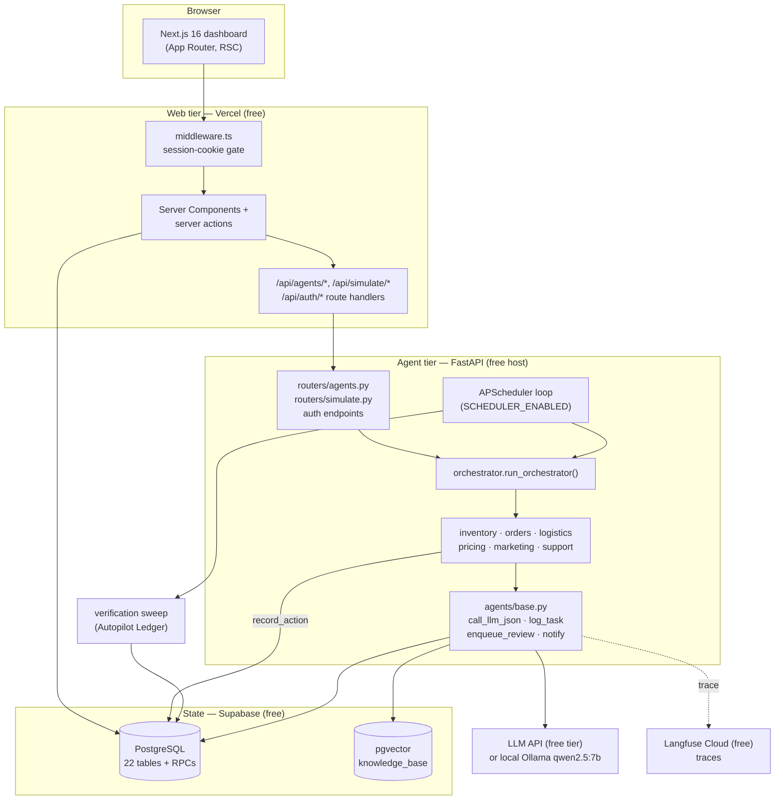

# TruCart — Solution Architecture (as built)

This document describes the system **that is actually implemented in this
repository**. The large AWS/Bedrock/LangGraph design in
`../ai-ecommerce-platform-plan.md` is the production target we would build with
funding; it is not what runs here. Everything below is deployable on free
tiers only (see `cost-estimate.md`).

## 1. Problem it solves

An e-commerce operator normally juggles six back-office functions — inventory,
orders, customer support, pricing, marketing, logistics — across separate tools,
which delays decisions and loses revenue. TruCart runs one **autonomous AI agent
per function** plus an **orchestrator** that runs a full cycle on a schedule.
Each agent reads the operational database, decides with an LLM advisor bounded by
deterministic guardrails, executes low-risk actions itself, and escalates
anything risky to a **human review queue**.

## 2. Component overview

| Layer | Tech | Runs |
|---|---|---|
| Dashboard | Next.js 16 (App Router, React 19, Tailwind v4, `packages/ui`) | Vercel Hobby |
| Web APIs / auth | Next.js route handlers, `jose` JWT session cookie | Vercel Hobby |
| Agents / orchestrator | FastAPI, APScheduler, `openai` SDK pointed at the LLM endpoint | Fly.io / Render / HF Space / Oracle Always-Free VM |
| Database | Supabase Postgres + `pgvector`, plain SQL migrations (no ORM) | Supabase free |
| LLM inference | Groq / Google AI Studio / OpenRouter free model, **or** local Ollama `qwen2.5:7b` + `nomic-embed-text` (768-dim) | free API or self-host |
| Tracing | Langfuse (`langfuse.openai` drop-in wrapper) | Langfuse Cloud free |

## 3. The six agents

All live in `backend/agents/` and expose `run_<name>_agent(correlation_id)`.
Each: loads tunables from `agent_config`, scans its slice of the DB, calls
`call_llm_json` for an advisory decision (deterministic fallback if the LLM is
unreachable), applies guardrails, executes auto-approved actions, calls
`enqueue_review` for the rest, writes one `agent_task_log` row, emits
`notify(...)` rows for the dashboard feed.

| Agent | Automates | Guardrail / escalation |
|---|---|---|
| `inventory` | low-stock → purchase order; **receives** approved POs after a lead time, incrementing on-hand stock | auto-approve if PO total ≤ `po_auto_approve_limit` (5000) else review |
| `orders` | confirm paid orders, reserve stock (`confirm_order_and_reserve` RPC) | unpaid / no items / short stock → review |
| `logistics` | create shipment for confirmed orders; drive `label_created→in_transit→out_for_delivery→delivered`; flag stalled shipments | exceptions → review |
| `pricing` | cost/margin/velocity repricing (`apply_price_change` RPC) | below-cost / margin-floor / move > `price_change_max_pct` (15%) → review |
| `marketing` | detect overstock → draft + (under budget) launch a clearance campaign | budget > `budget_auto_approve_limit` → review |
| `support` | triage open tickets with KB RAG; resolve or refund | refund clamped to order total; > `refund_auto_approve_limit` (100) → review |

**Coverage boundary (integration points, simulated in the demo):** customer
storefront / checkout / payment / fraud, real ESP & carrier APIs, returns/RMA,
tax & invoicing, competitor-price ingestion. TruCart is designed to consume
these through adapters; here orders arrive via the **simulated order generator**
(`POST /api/simulate/orders`, "Simulate incoming orders" on `/dashboard/orders`).

## 4. Multi-agent coordination

Coordination is **sequential + shared-state**, deliberately simple:

- `orchestrator.py` holds a static `_PIPELINE` (inventory → orders → logistics →
  pricing → marketing → support) and calls each runner once under a single
  `correlation_id`. One agent failing does not abort the cycle.
- Agents do **not** message each other. They hand off through the database:
  inventory writes POs that pricing later reads for cost basis; orders sets
  `confirmed`, which logistics picks up.
- The other hand-off is agent → `review_queue` → human → `updateReviewStatus`
  (`apps/web/app/dashboard/actions.ts`), which cascades the decision into the
  domain table (PO, price, order, refund, campaign, shipment) and records the
  reviewer id + note.
- `correlation_id` groups a cycle across `agent_task_log` and Langfuse; it is not
  a message channel.

There is no event bus. Adding DB-trigger / webhook triggering is noted as future
work.

## 4a. Autopilot Ledger (verified-outcome accounting)

The distinguishing feature. Every judgement call the pricing / inventory /
marketing / support agents make (auto-executed **or** escalated) is captured by
`backend/agents/ledger.py` `record_action(...)` as one `agent_action` row with:

- the decision parameters,
- a **counterfactual baseline** — the "do nothing" ₹ outcome, computed now from
  data the agent already has (trailing sales velocity, margins, stock cover),
  with the formula and its inputs stored so it is auditable, and
- `verify_after` — a settle window per action type (`store_config`
  `ledger_settle_days_*`).

`backend/agents/verification.py` `run_verification_sweep()` (a second APScheduler
job, or `POST /api/ledger/verify`) measures what actually happened from the
operational tables, books `realized_delta_inr` vs `baseline_delta_inr`, and
grades each decision `win | loss | neutral`. `evaluate_autonomy()` then scores
the agent over its last `ledger_min_sample` verified decisions; if the win-rate
is out of the `[ledger_win_rate_floor, ledger_win_rate_ceiling]` band it enqueues
a `review_queue` item of `item_type='autonomy_adjustment'` proposing a concrete,
one-click config change (e.g. `budget_auto_approve_limit 200 → 120`), linked to
the losing decisions. Approving it in `/dashboard/review` writes the new
`store_config` / `agent_config` value.

`/dashboard/ledger` surfaces the per-agent **Trust Score**, realized ₹
contribution (measured vs estimated split — marketing/support outcomes are
modelled, not instrumented, and labelled as such), and a drill-down to every
decision's baseline formula and actual outcome. Operator rejections can attach a
one-line standing rule (`agent_policy`) that `base.py` `load_active_policies()`
injects into that agent's LLM prompt on every future run.

The order and logistics agents are mechanical (no LLM judgement, fully simulated
lifecycle) and are not scored by the Ledger.

The agents run **independently of the Ledger**: `record_action` is best-effort
(a failed insert is logged and swallowed), so a decision is never blocked by
Ledger unavailability — including when `016_ledger.sql` has not been applied.

## 5. Autonomy

- **Manual:** "Run Agent" / "Run full cycle" on `/dashboard/agents` → route
  handler → FastAPI runner.
- **Scheduled:** `backend/scheduler.py` starts an APScheduler `BackgroundScheduler`
  when `SCHEDULER_ENABLED=true`, running `run_orchestrator` every
  `ORCHESTRATOR_INTERVAL_MINUTES` (default 10). This is what "autonomous" means
  in the deployed target. `/dashboard/agents` shows an "Autonomous mode" badge
  and the last cycle time (`GET /api/agents/scheduler`).
- Every runner is idempotent (skips items already queued / with open POs / a
  recent price change) and bounded by `max_items_per_run`, so repeated cycles are
  safe.

## 6. Security model

- Single staff role (`users.role = 'admin'`). Login → `POST /api/auth/login`
  (FastAPI verifies bcrypt/SHA1, in-memory rate limit) → Next route signs an
  8-hour HS256 JWT into an httpOnly `trucart_session` cookie.
- `middleware.ts` verifies that cookie for `/dashboard/*`, `/api/agents/*`,
  `/api/simulate/*`; unauthenticated API hits get 401, pages redirect to
  `/login`.
- The FastAPI service uses the Supabase **service-role** key and must not be
  exposed publicly beyond the Vercel proxy in the deployed target.
- Password change: `POST /api/auth/change-password` (re-verifies current
  password). Account deactivation sets `users.is_active = false`.

## 7. Data

22 tables, documented in `../database-schema-reference.md` (+ the "Migrations
007–015 addendum" there for what post-dates the original doc). Key RPCs:
`apply_price_change`, `create_po_with_review`, `confirm_order_and_reserve`
(`013_agent_rpcs.sql`), `match_knowledge_base` (`012_kb_match_fn.sql`).
Agent behaviour is tuned by rows in `agent_config` (editable at
`/dashboard/agents` → Configure) and approval ceilings in `store_config`.
